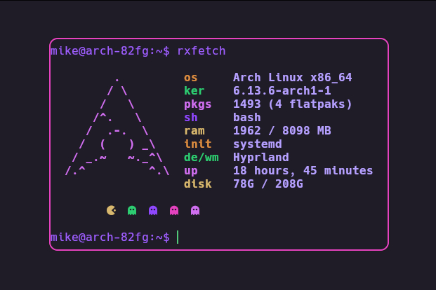

<div align="center">
<h1>rxfetch-arch<h1>
 


<br>

</div>

## About

My modification of the [custom system fetching tool written in bash script](https://github.com/mngshm/rxfetch).

## Requirements

- Material design icons as for that pacman and ghost icons.
- You need to put the provided fonts in the fonts directory to get the icons work.
- If wanted you can change the source code of the fetch as per your needs.
- If you already use material-design-icons you can just use the command below to install it.

## Quick Installation

You can install rxfetch with this one-line command:

```yaml
curl -s https://raw.githubusercontent.com/Mangeshrex/rxfetch/main/install.sh | sudo bash
```

For Termux users:
```yaml
curl -s https://raw.githubusercontent.com/Mangeshrex/rxfetch/main/install.sh | bash
```

## Run with curl

If you don't wanna clone this repo or install rxfetch, you can use curl.

```yaml
$ curl https://raw.githubusercontent.com/rocketmike12/rxfetch-arch/main/rxfetch | bash
```

## Installation

### Manual:

- Clone this repository & run rxfetch.

```yaml
# clones the rxfetch-arch repo
$ git clone https://github.com/rocketmike12/rxfetch-arch
# cd into rxfetch-arch 
$ cd rxfetch-arch 
# copy the fonts 
$ cp ttf-material-design-icons/* $HOME/.local/share/fonts
# update fontconfig
$ fc-cache -fv
# run rxfetch
$ ./rxfetch
```

> If you have the fonts installed then just run this command.

```yaml
$ wget https://raw.githubusercontent.com/rocketmike12/rxfetch-arch/main/rxfetch && chmod +x rxfetch
```

- You can also add rxfetch to PATH by placing it in `/usr/local/bin`

```yaml
$ sudo cp rxfetch /usr/local/bin
```

- Upload your custom rxfetch script [ here ](https://github.com/Mangeshrex/rxfetch/issues/21)

## Contributors

<a href="https://github.com/rocketmike12/rxfetch/graphs/contributors">
  
</a>

Made with [contrib.rocks](https://contrib.rocks).
