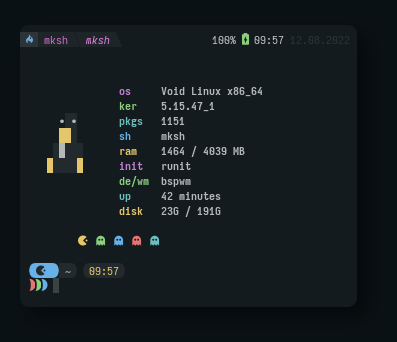

# Rxfetch 

<div align="center">

</div> 

<p align="center"> 
 


</p>

## About 

Custom system fetching tool which is made in bash script.

## Requirements 
- Material design icons as for that pacman and ghost icons.
 - You need to put the provided fonts in the fonts directory to get the icons work.
 - If wanted you can change the source code of the fetch as per your needs.
 - If you already use material-design-icons you can just use the above command to install it.


## Installation

### Arch Linux:
  rxfetch is available in the AUR, you can install it with
```sh 
yay -S rxfetch 
```

### Termux (Android):
  Included in main repository, install with:
```sh
  pkg in rxfetch
```

- Clone this repository & run rxfetch.
```sh 
git clone https://github.com/mangeshrex/rxfetch
cd rxfetch
cp ttf-material-design-fonts/* $HOME/.local/share/fonts
fc-cache -fv
./rxfetch
```
> If you have the fonts installed then just run this command.

```sh 
wget https://raw.githubusercontent.com/Mangeshrex/rxfetch/main/rxfetch && chmod +x rxfetch
```

-- You can also add rxfetch to PATH by placing it in /usr/local/bin

```sh 
sudo cp rxfetch /usr/local/bin
```

* Upload your custom rxfetch script [[https://github.com/Mangeshrex/rxfetch/issues/21][here]]

## Contributors 
<a href="https://github.com/Mangeshrex/rxfetch/graphs/contributors">
  
</a>

Made with [contrib.rocks](https://contrib.rocks).

